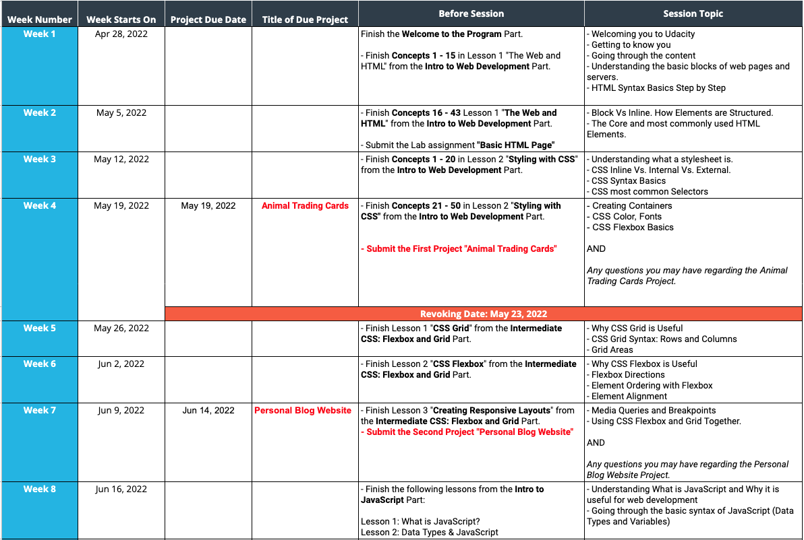
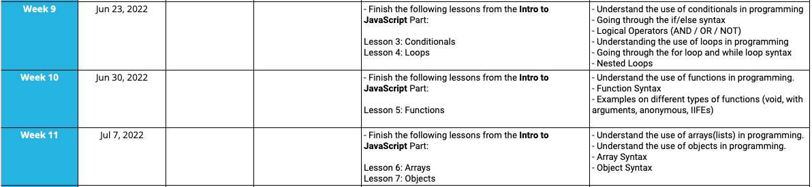
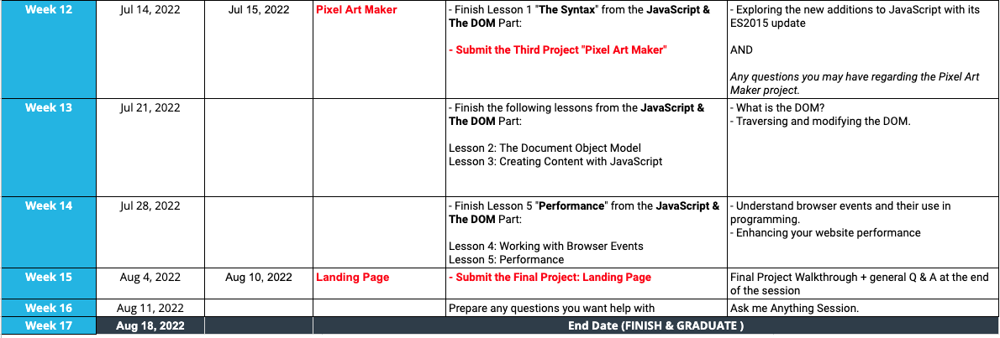

# Udacity Front-End Development NanoDegree

  This repository will host the connect session files we will work from throughout the course.  The weekly schedule will serve as our outline for how we progress through the connect sessions.  however, we will have some other activities and information as needed, determined by the progression of the course.

## Weekly Schedule

  
  
  

## About Me

  My name is Rockwell and I am a Fullstack, DevOps developer based out of Madison WI.  When I am not writing code I am probably playing guitar or chasing around my buddies Gus and Mitch.

  
<strong>Gus</strong>

  
  
<strong>Mitch</strong>

  

