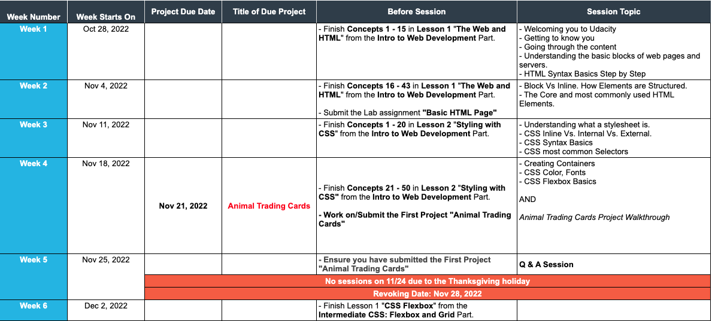
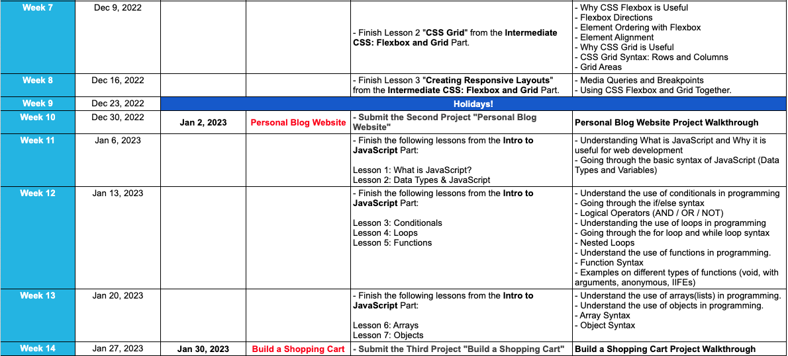
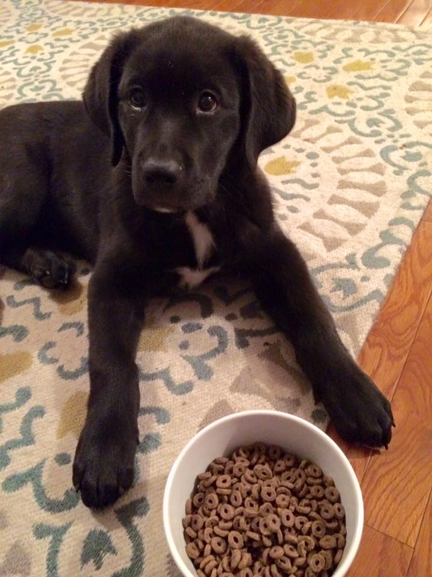
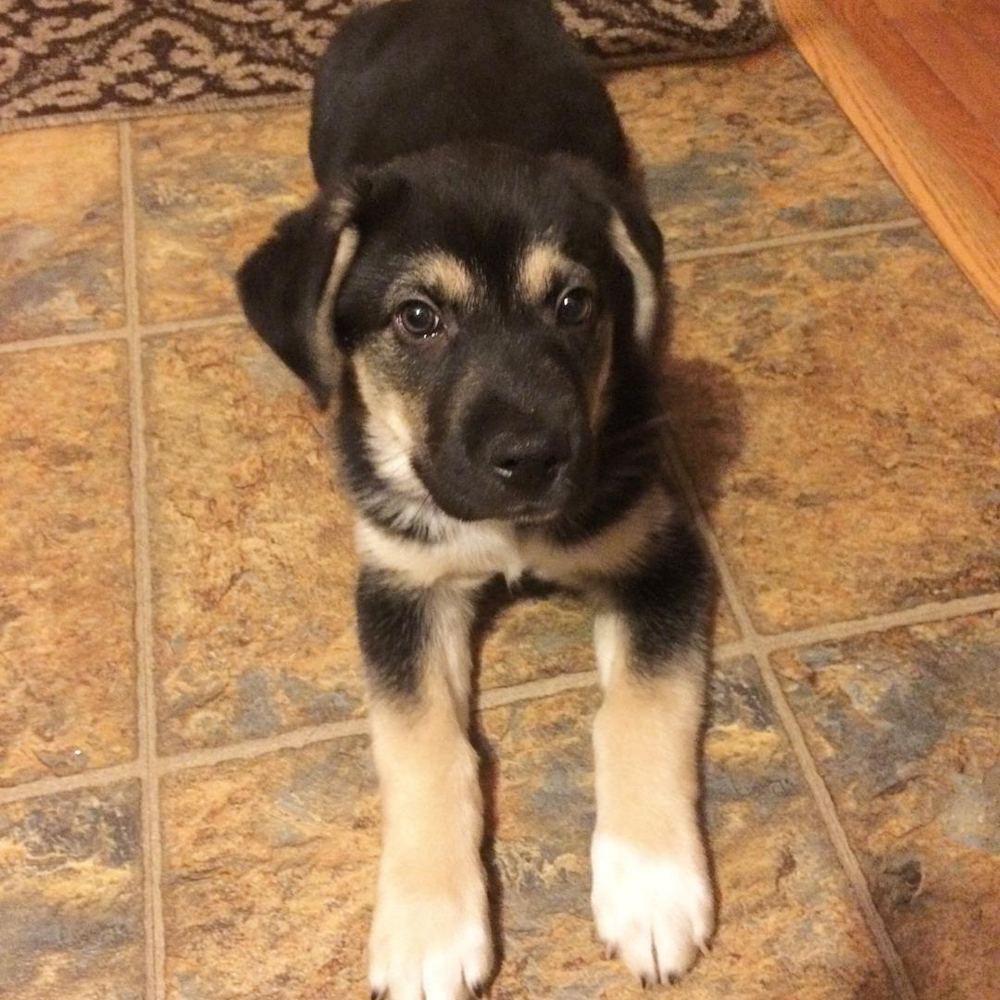

# Udacity Front-End Development NanoDegree

  This repository will host the connect session files we will work from throughout the course.  The weekly schedule will serve as our outline for how we progress through the connect sessions.  however, we will have some other activities and information as needed, determined by the progression of the course.

## Weekly Schedule

  
  

## Resources

  * Office Hours:
    * Tuesday 6 - 7 PM EST
    * Thursday 6 -7 PM EST
    * Sunday 10-12PM EST

  * FAQs: https://sites.google.com/udacity.com/onetenscholarship-c3/faqs
  * Weekly Schedule Google Doc (click 'Front End Web Development' tab): https://sites.google.com/udacity.com/onetenscholarship-c3/student-resources/weekly-schedule
  * Code of Conduct: https://sites.google.com/udacity.com/onetenscholarship-c3/student-resources/code-of-conduct
  * Career Resources: https://sites.google.com/udacity.com/onetenscholarship-c3/careers

## About Me

  My name is Rockwell and I am a Fullstack, DevOps developer. I live in Madison, Wisconsin with my wife and our 2 dogs  When I am not writing code I am probably playing guitar or chasing around my best buddies Gus and Mitch.

  
<strong>Gus</strong> aka Gussy-so-fussy

  
  
<strong>Mitch</strong> aka Mitchy nom-noms

  

