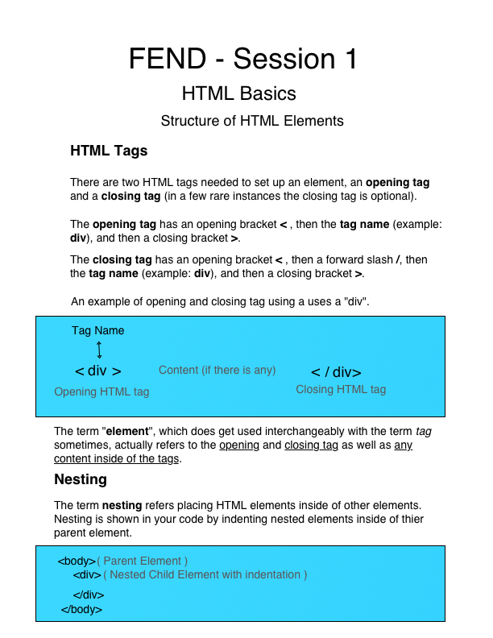

# Connect Session #1

## Lesson Outline

  * Ice-Breaker
    * Go around the room and have everyone introduce themselves
      * Share what got you interested in this course
      * Share one new thing you have learned so far big or small
  * Status Check in
    * Discussion of current student progress
    * Any projects due, how is that going?
  * Topic/Project/ Learning Session
  * Break
    * Activity
  * Recap of lesson
  * Q & A

#### Activity

  * HTML Basic Syntax
    * This is an introductory lesson to get us comfortable with basic HTML syntax with elements
    * build a `

` (or multiple div's) inside a <section> element to produce some cards
    * https://codepen.io/rockwellwindsor/pen/oNpKrqQ?editors=1100

#### Handout

  
  <figcaption>Right Click to view image in broswer, left click and select "save image as" to save the image to your computer.</figcaption>

#### Resources

  * https://www.w3schools.com/html/
    * Basics: https://www.w3schools.com/html/html_basic.asp
    * Elements: https://www.w3schools.com/html/html_elements.asp 
    * tags reference: https://www.w3schools.com/tags/
    * https://www.w3schools.com/html/html_symbols.asp
    * https://www.w3schools.com/html/html_emojis.asp
    * https://www.w3schools.com/charsets/ref_emoji.asp
  * Codepen:  https://codepen.io/
