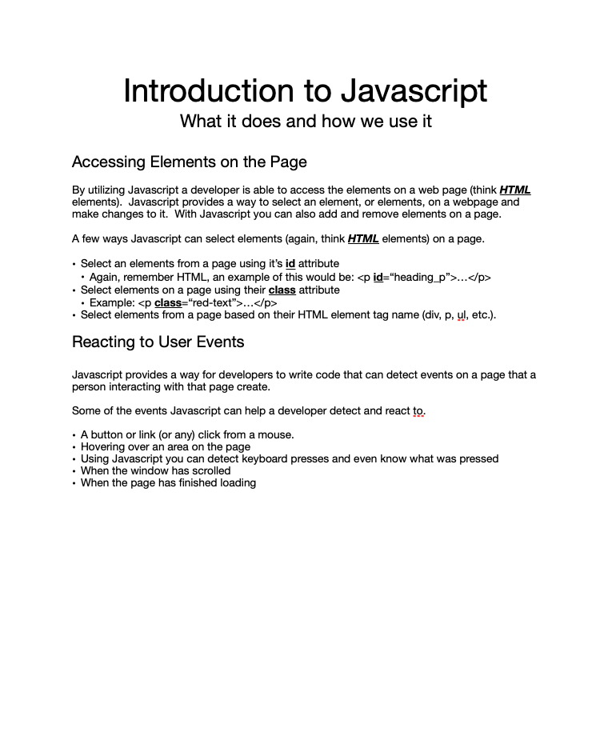
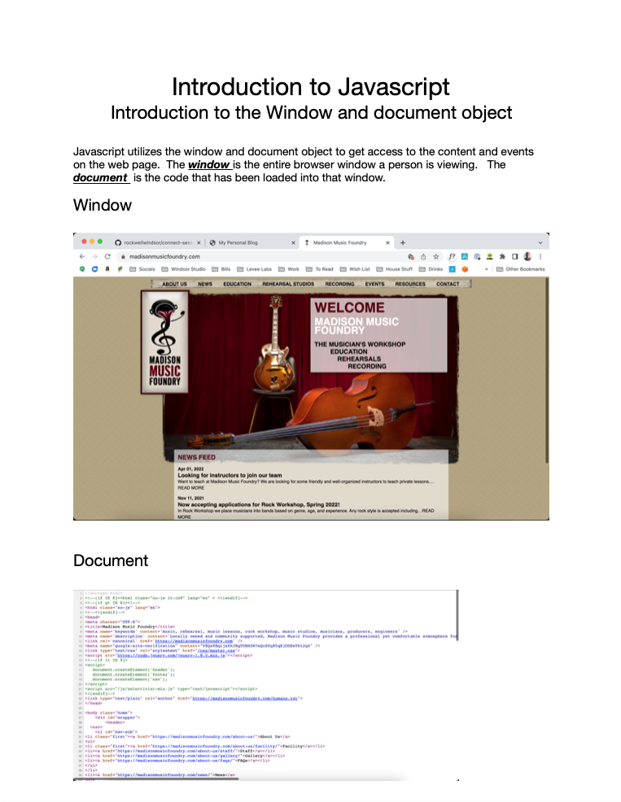
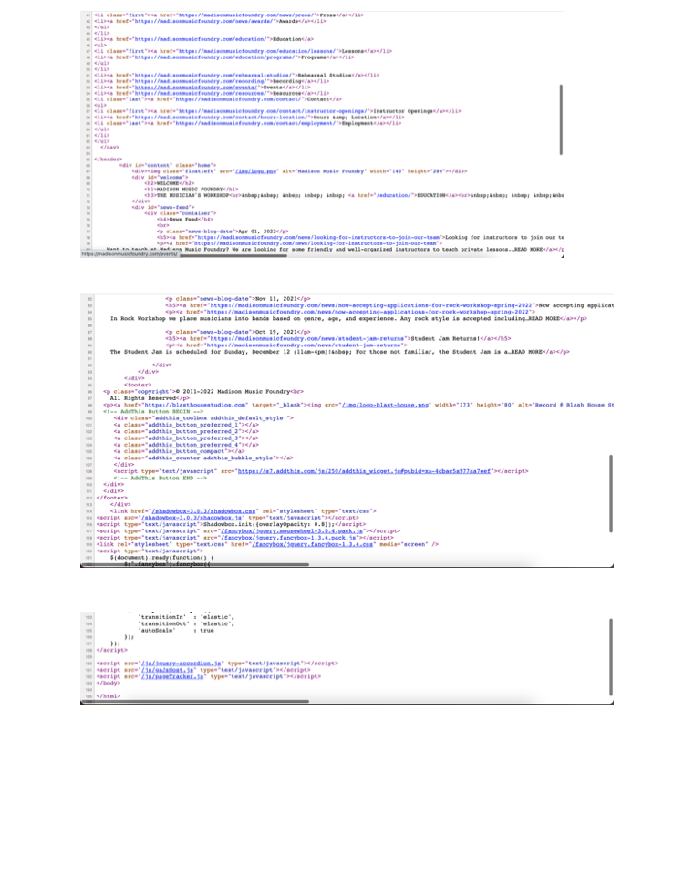
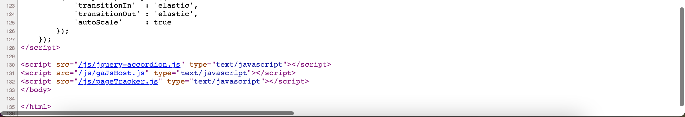
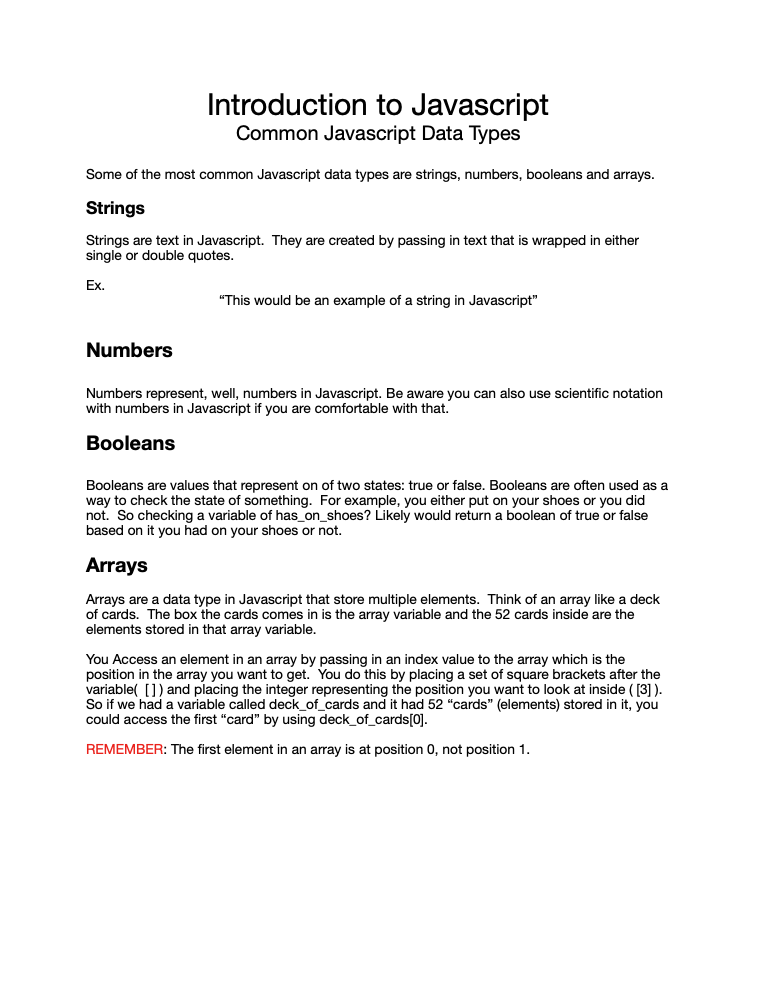

# Connect Session #8

  * Introduction to Javascript

## Lesson Outline

  * Ice-Breaker
    * Go around the room and have everyone introduce themselves
      * Share what got you interested in this course
      * Share one new thing you have learned so far big or small
  * Status Check in
    * Discussion of current student progress
    * Any projects due, how is that going?
  * Topic/Project/ Learning Session
  * Break
    * Activity
  * Recap of lesson
  * Q & A

####

  * Something to be thinking about going forward:
  <blockquote>
    The name of a variable, function, class, CSS class or id, should answer all the "big" questionsIt shoudl tell you why it exists, what it does, and how it is used.  If the name requires a comment then the name does not reveal it's intent"
  </blockquote>

  * Ex. 
  <code>
    let e; // Elapsed time of day
  </code>

#### Activity

  * Winning at Javascript
    * https://codepen.io/rockwellwindsor/pen/oNEJbXN

#### Handout

  * Right Click to view image in broswer, left click and select "save image as" to save the image to your computer.
     
  

#### Resources

  * W3 Introduction: https://www.w3schools.com/js/default.asp
    * Basic functionality introduction: https://www.w3schools.com/js/js_intro.asp
    * Tutorial: https://www.w3schools.com/js/
    * "let" keyword: https://www.w3schools.com/js/js_let.asp
    * "const" keyword: https://www.w3schools.com/js/js_const.asp
    * Data types: https://www.w3schools.com/js/js_datatypes.asp
  * What is Javascript: https://developer.mozilla.org/en-US/docs/Learn/JavaScript/First_steps/What_is_JavaScript
