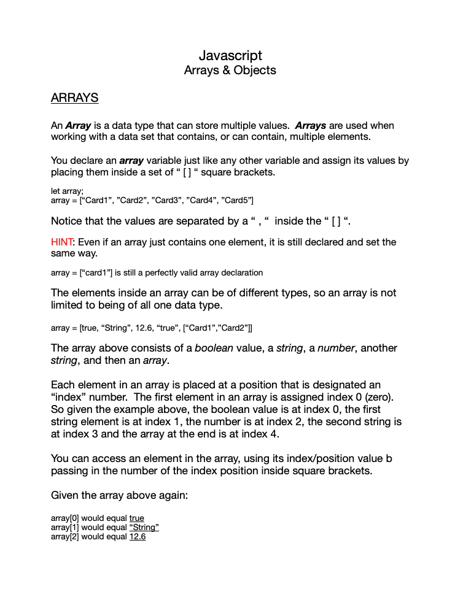
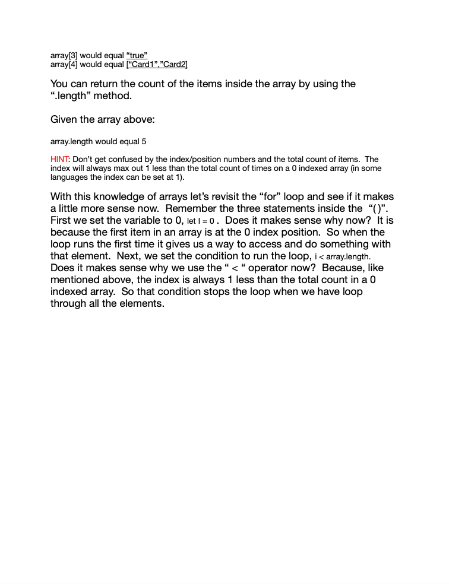
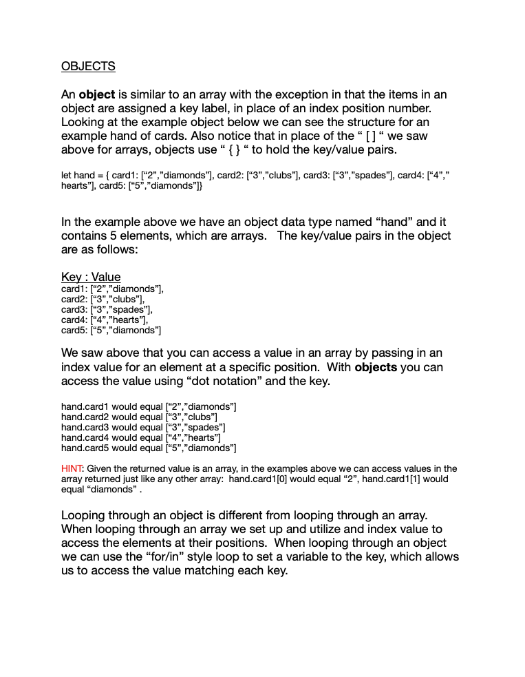
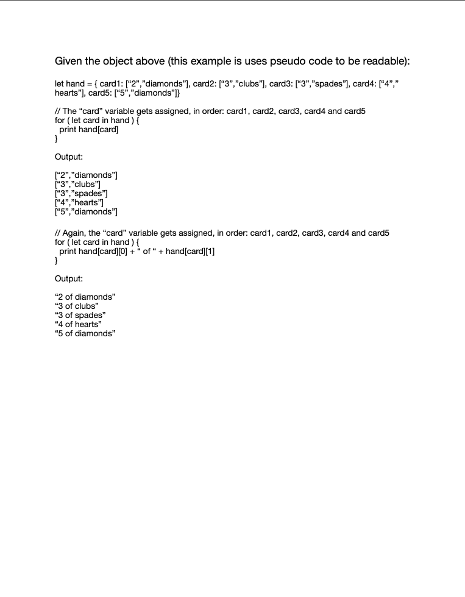

# Connect Session #14

## Lesson Outline

  * Ice-Breaker
  * Status Check in
    * Discussion of current student progress
  * Topic/Project/Learning Session
  * Break
    * 10 minutes
  * Recap of lesson
  * Q & A

#### Lesson

  * Arrays and objects

#### Activity

  * Deal to yourself part 3 - More deals
    * https://codepen.io/rockwellwindsor/pen/WNzwrzx
      * The to-dos are on lines: 24, 37, 41, 42, 43, 44 and 19

#### Handout

  * Right Click to view image in broswer, left click and select "save image as" to save the image to your computer.
     

#### Resources

  * Arrays: https://www.w3schools.com/js/js_arrays.asp
    * Methods: https://www.w3schools.com/js/js_array_methods.asp
    * Reference: https://www.w3schools.com/jsref/jsref_obj_array.asp
  * Objects: https://www.w3schools.com/js/js_objects.asp
