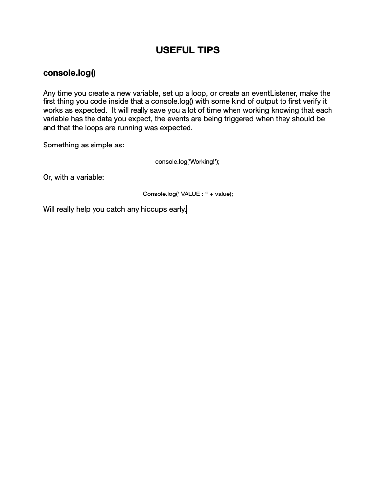

# Connect Session #14

## Lesson Outline

  * Ice-Breaker
  * Status Check in
    * Discussion of current student progress
  * Topic/Project/Learning Session
  * Break
    * 10 minutes
  * Recap of lesson
  * Q & A

#### Lesson

  * Talking about the window object, events and discussing some tips for the landing page project

#### Handout

  * Right Click to view image in broswer, left click and select "save image as" to save the image to your computer.
      

#### Resources

  * Browser Events: https://javascript.info/introduction-browser-events
    * Capture/Bubbling: https://stackoverflow.com/questions/4616694/what-is-event-bubbling-and-capturing
    * Window Object: https://www.w3schools.com/jsref/obj_window.asp
