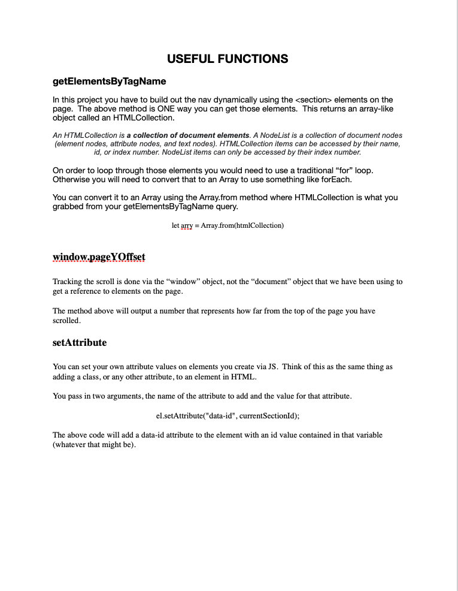
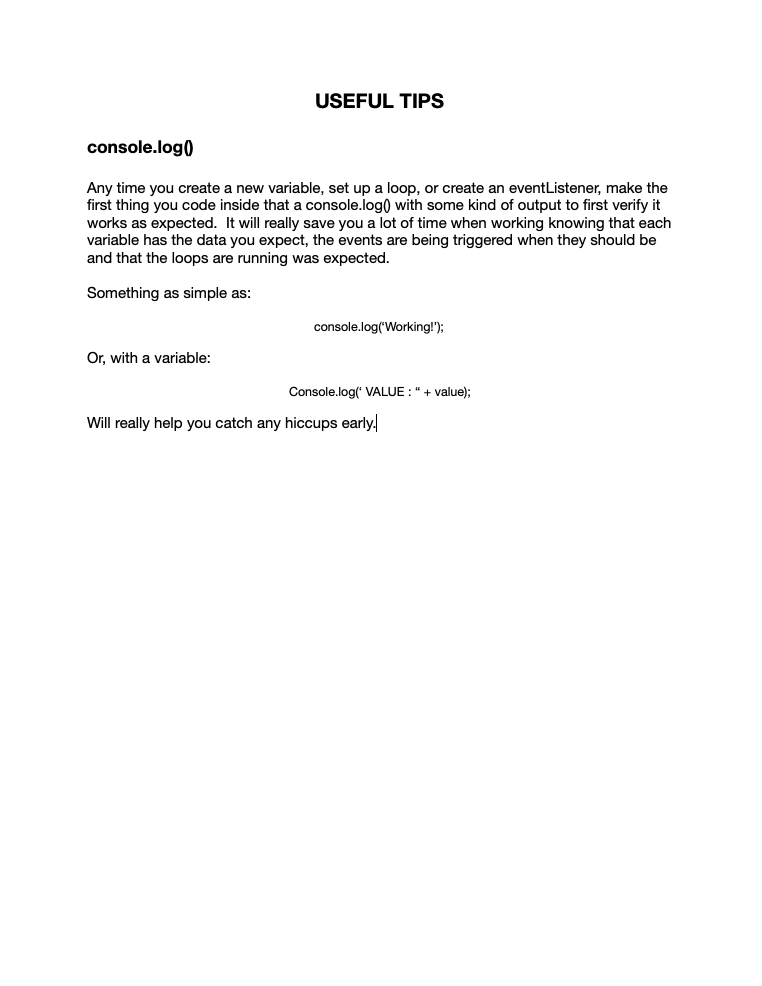

# Connect Session #18

## Lesson Outline

  * Ice-Breaker
  * Status Check in
    * Discussion of current student progress
  * Topic/Project/Learning Session
  * Break
    * 10 minutes
  * Recap of lesson
  * Q & A

#### Lesson

  * Where to go next?
    * jQuery
    * What is "Back-End" Development

#### Activity

  * How'd you do that?
    * https://codepen.io/rockwellwindsor/pen/BaYBbvy

#### Handouts

  * Right Click to view image in broswer, left click and select "save image as" to save the image to your computer.
      

#### Resources

  * jQuery: https://www.w3schools.com/jquery/
  * What is Back-End Development https://www.w3schools.com/whatis/
    *  https://www.udacity.com/blog/2020/12/front-end-vs-back-end-vs-full-stack-web-developers.html#:~:text=what%20is%20a%20Back
    * FullStack Development: https://www.w3schools.com/whatis/whatis_fullstack.asp
  * What to do your first year: https://www.shecancode.io/blog/six-things-ive-learned-in-my-first-year-as-a-software-developer
    * https://www.freecodecamp.org/news/my-first-year-as-a-software-engineer/
    * https://www.freecodecamp.org/news/ace-your-first-year-as-a-junior-developer-with-this-advice-bbc68b6fe2d9/
