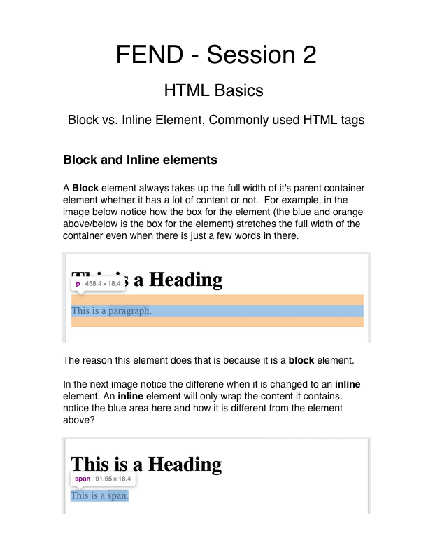

# Connect Session #2

  * Block vs Inline elements in HTML
  * Commonly used HTML elements

## Lesson Outline

  * Ice-Breaker
    * What went well this week?  What did not?  Any major roadblocks or successes?
  * Status Check in
    * Discussion of current student progress
    * Any projects due, how is that going?
  * Topic/Project/ Learning Session
  * Break
    * Activity
  * Recap of lesson
  * Q & A

#### Activity

  * More HTML nesting
    * https://codepen.io/rockwellwindsor/pen/dydyevr

#### Handout

  
  
  <figcaption>Right Click to view image in broswer, left click and select "save image as" to save the image to your computer.</figcaption>

#### Resources

  * https://www.w3schools.com/html/
    * file paths: https://www.w3schools.com/html/html_filepaths.asp
  * HTML validator: https://validator.w3.org/
    * File Upload: https://validator.w3.org/#validate_by_upload
    * Direct Input: https://validator.w3.org/#validate_by_input