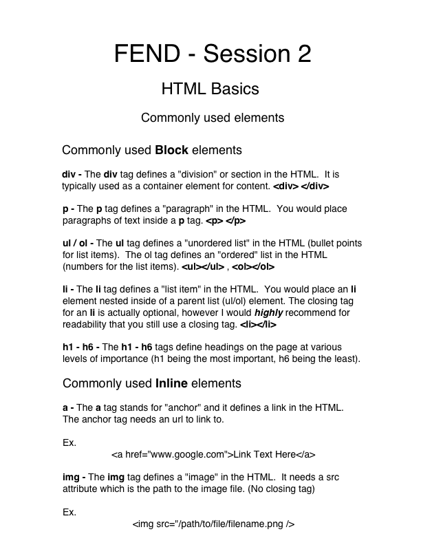

# Connect Session #2

  * Block vs Inline elements in HTML
  * Commonly used HTML elements

## Lesson Outline

  * Ice-Breaker
    * What went well this week?  What did not?  Any major roadblocks or successes?
  * Status Check in
    * Discussion of current student progress
    * Any projects due, how is that going?
  * Topic/Project/ Learning Session
  * Break
    * Activity
  * Recap of lesson
  * Q & A

#### Activity

  * 

#### Handout

  
  
  <figcaption>Right Click to view image in broswer, left click and select "save image as" to save the image to your computer.</figcaption>

#### Resources

  * https://www.w3schools.com/html/
    * tags reference: https://www.w3schools.com/tags/
    * https://www.w3schools.com/html/html_symbols.asp
    * https://www.w3schools.com/html/html_emojis.asp
    * https://www.w3schools.com/charsets/ref_emoji.asp
  * Codepen:  https://codepen.io/