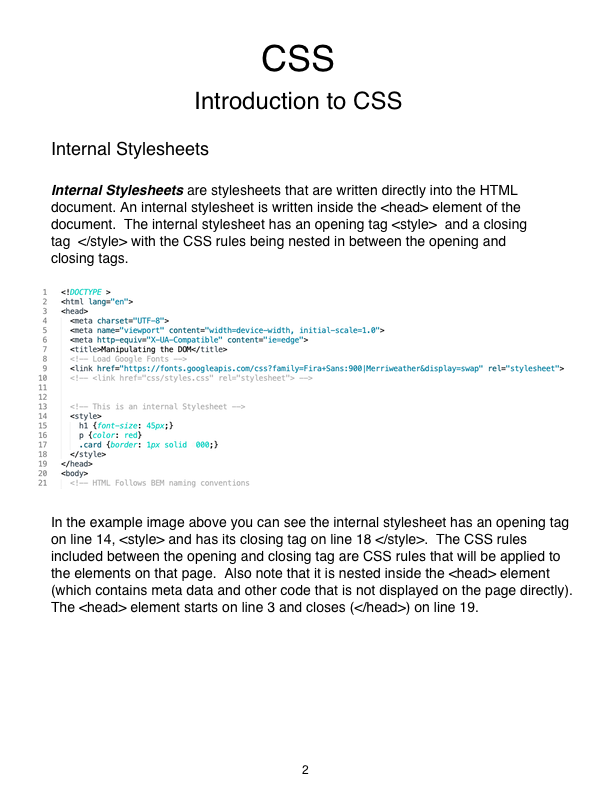
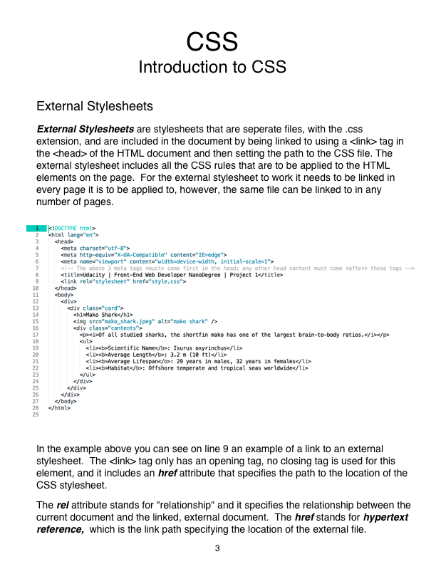
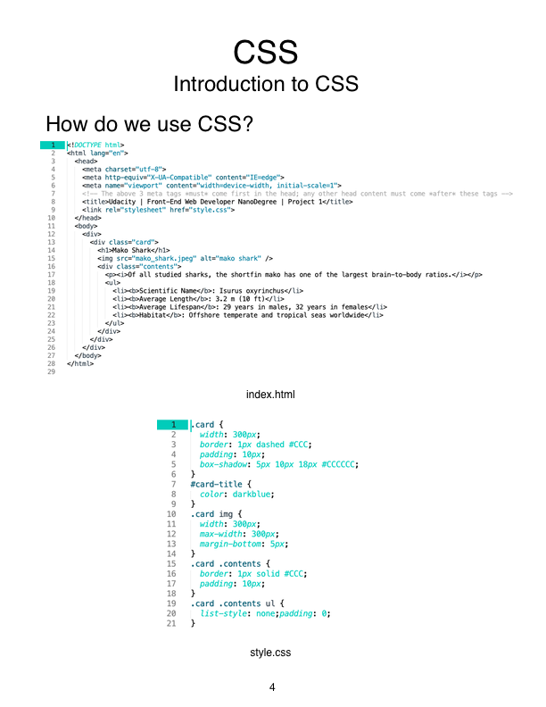
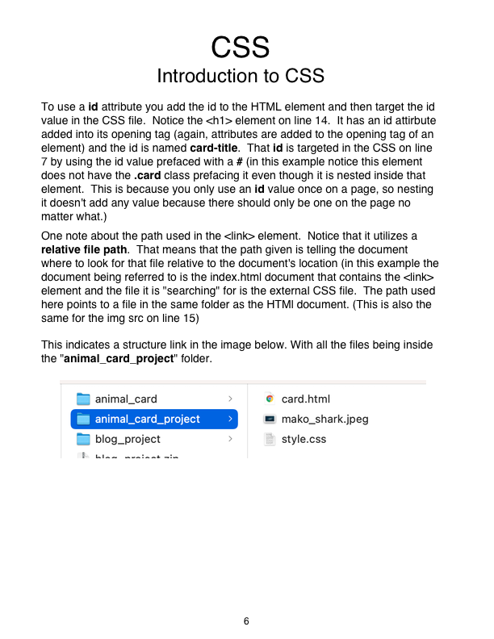
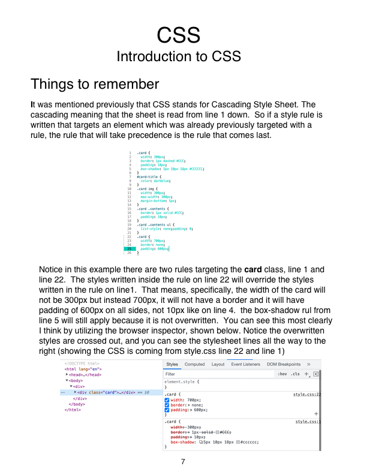

# Connect Session #3

  * Introduction to CSS

## Lesson Outline

  * Ice-Breaker
    * What went well this week?  What did not?  Any major roadblocks or successes?
  * Status Check in
    * Discussion of current student progress
    * Any projects due, how is that going?
  * Topic / Project / Learning Session
  * Break
    * Activity
  * Recap of lesson
  * Q & A

  * Class Session times this week to attend in order to make up for the holiday break.  All times are EST
    * https://files.slack.com/files-pri/T046D6UNPMX-F049KRD16KX/image.png

  * Project #1 Walkthrough
    * https://drive.google.com/file/d/1U9t2n-BPqz8P0Xv3AszdrP4XKWZNnRcB/view

#### Activity

  * Making your first Card
    * https://codepen.io/rockwellwindsor/pen/OJEjExN

#### Handouts

   
  
  

  <figcaption>Right Click to view image in broswer, left click and select "save image as" to save the image to your computer.</figcaption>

#### Resources

  * CSS: https://www.w3schools.com/css/css_intro.asp
    * Syntax: https://www.w3schools.com/css/css_syntax.asp
    * Selectors: https://www.w3schools.com/css/css_selectors.asp
    * How to use CSS: https://www.w3schools.com/css/css_howto.asp
    * the Link tag: https://www.w3schools.com/tags/tag_link.asp
    * Using an ID: https://www.w3schools.com/html/html_id.asp
    * Using a CLASS: https://www.w3schools.com/html/html_classes.asp
  * File Paths: https://www.w3schools.com/html/html_filepaths.asp
    * file path blog post: https://www.kirupa.com/html5/all_about_file_paths.htm
  * Inline styles, Internal Stylesheets and External Stylesheets: https://www.hostpapa.com/knowledgebase/understanding-inline-internal-external-css-styles/.
  * 7 Cheatsheets every front end developer must know: https://blog.devgenius.io/7-useful-front-end-web-developer-cheatsheets-you-must-know-32e9ef3c03bb?gi=831fef7df1a5

