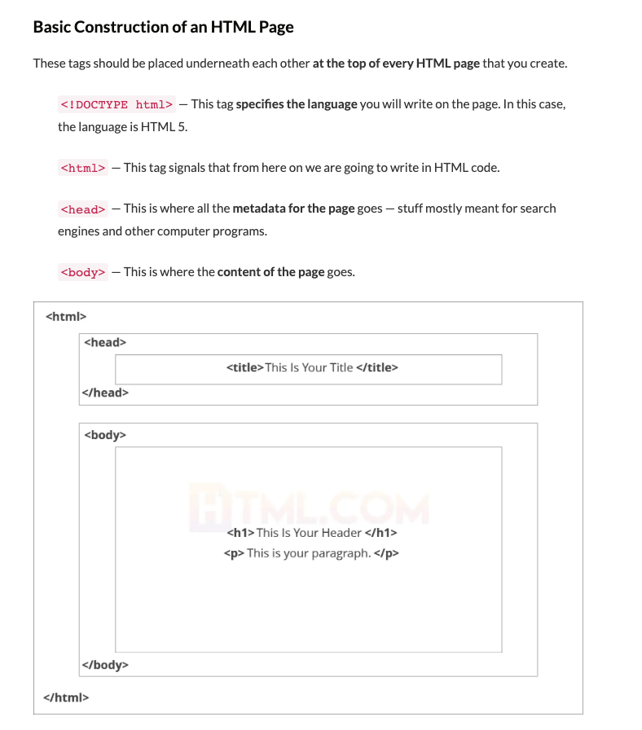
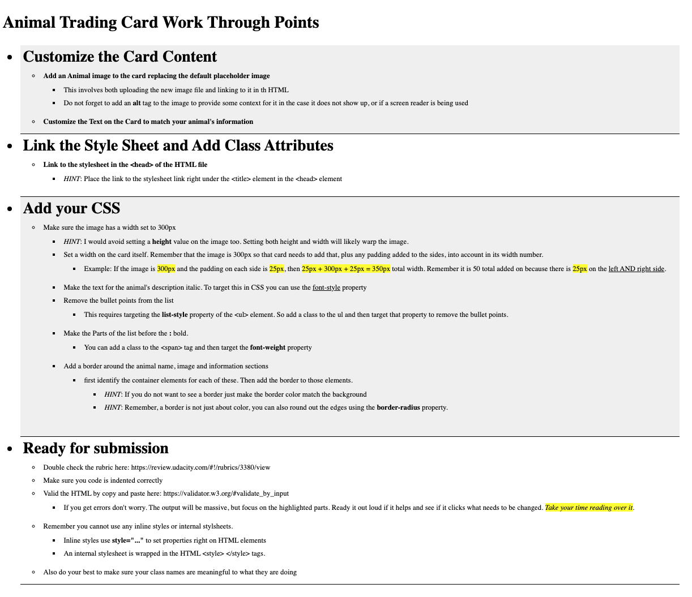
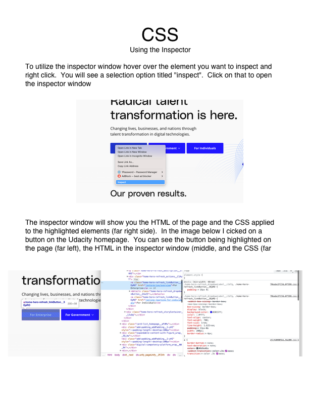
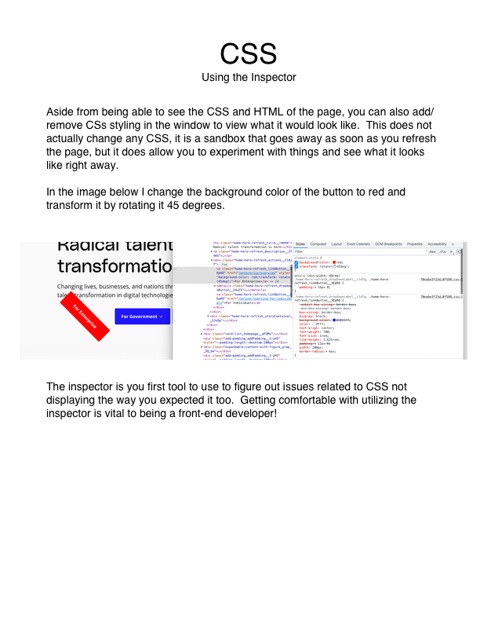

# Connect Session #4

  * Continuation of Understanding CSS

## Lesson Outline

  * Ice-Breaker
    * What went well this week?  What did not?  Any major roadblocks or successes?
  * Status Check in
    * Discussion of current student progress
    * Any projects due, how is that going?
  * Topic / Project / Learning Session
  * Break
    * Activity
  * Recap of lesson
  * Q & A

#### Activity

  * Build a Card
    * https://codepen.io/rockwellwindsor/pen/rNJmWQR

#### Handouts

  .   
  <figcaption>Right Click to view image in broswer, left click and select "save image as" to save the image to your computer.</figcaption>

#### Resources

  * Fonts: https://www.w3schools.com/css/css_font.asp
    * Google Fonts: https://fonts.google.com/
  * Colors: https://www.w3schools.com/css/css_colors.asp
    * W3 Hex colors: https://www.w3schools.com/css/css_colors_hex.asp
    * Hex color reference: https://www.color-hex.com/
  * W3 CSS tutorial with Examples: https://www.w3schools.com/css/default.asp
  * W3 CSS Quiz: https://www.w3schools.com/css/css_quiz.asp
  * HTML Refresher: https://html.com/