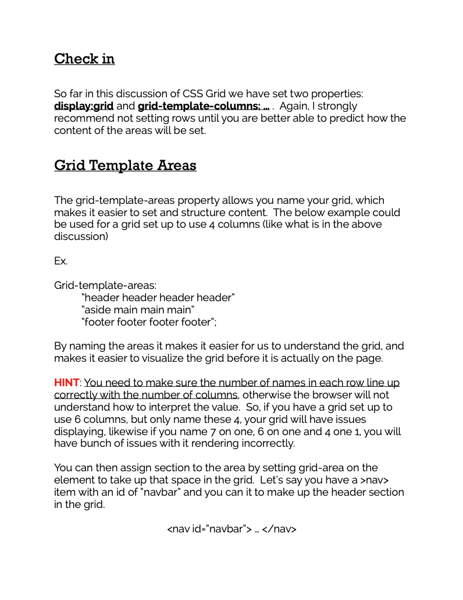
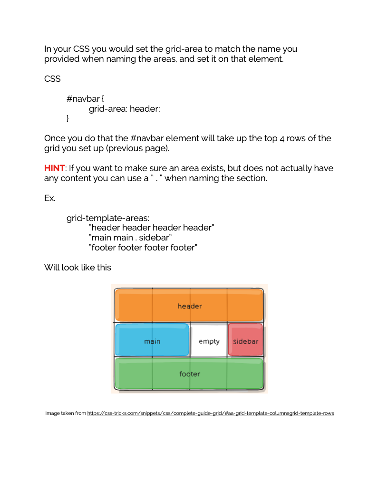
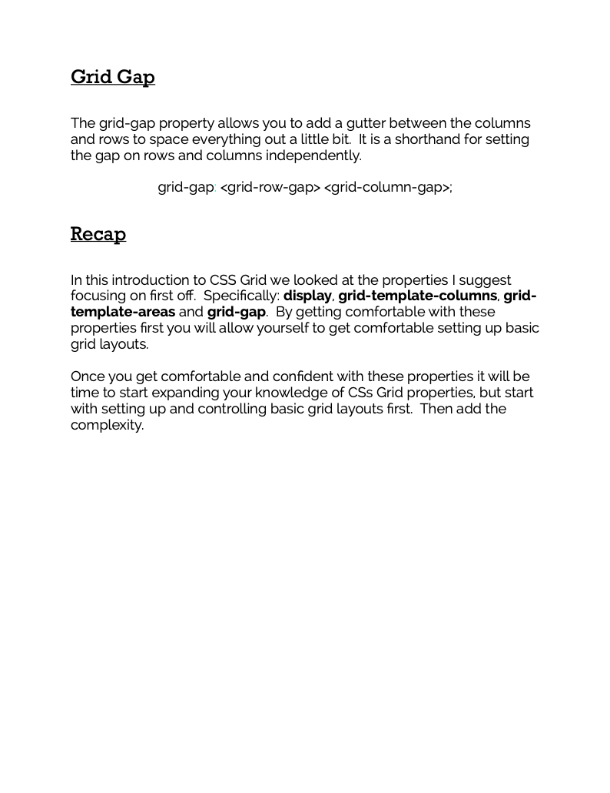

# Connect Session #5

  * Introduction to CSS Grid

## Lesson Outline

  * Ice-Breaker
    * What went well this week?  What did not?  Any major roadblocks or successes?
  * Status Check in
    * Discussion of current student progress
    * Any projects due, how is that going?
  * Topic / Project / Learning Session
  * Break
    * Activity
  * Recap of lesson
  * Q & A

#### Activity

  * Organize the Table
    * https://codepen.io/rockwellwindsor/pen/dyZdedN

#### Handouts

   
   

  <figcaption>Right Click to view image in broswer, left click and select "save image as" to save the image to your computer.</figcaption>

#### Resources

  * CSS Tricks: https://css-tricks.com/
    * CSS Tricks CSS Grid Guide: https://css-tricks.com/snippets/css/complete-guide-grid/
  * CSS Grid Games: https://cssgridgarden.com/
  * Using the Inspector: https://www.theodinproject.com/lessons/foundations-inspecting-html-and-css