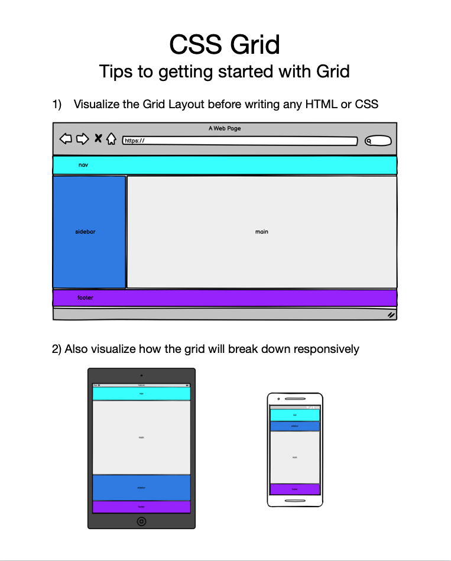

# Connect Session #5

  * Introduction to CSS Grid
    * See the blog project starter guide in the assets folder above to view my suggestions for how to start the project

## Lesson Outline

  * Ice-Breaker
    * What went well this week?  What did not?  Any major roadblocks or successes?
  * Status Check in
    * Discussion of current student progress
    * Any projects due, how is that going?
  * Topic / Project / Learning Session
  * Break
    * Activity
  * Recap of lesson
  * Q & A

#### Activity

  * Organize the Table
    * https://codepen.io/rockwellwindsor/pen/dyZdedN

#### Handouts

  * Right Click to view image in broswer, left click and select "save image as" to save the image to your computer.

     
     
     
    <figcaption>to see my example code for responsiveness look in the "assets" folder above</figcaption>

#### Resources

  * CSS Grid: https://www.w3schools.com/css/css_grid.asp
    * grid-template-columns: https://www.w3schools.com/cssref/pr_grid-template-columns.asp
    * grid-template-areas: https://www.w3schools.com/cssref/pr_grid-template-areas.asp
    * fr value: https://css-tricks.com/introduction-fr-css-unit/
  * CSS Tricks: https://css-tricks.com/
    * CSS Tricks CSS Grid Guide: https://css-tricks.com/snippets/css/complete-guide-grid/
  * CSS Grid Games: https://cssgridgarden.com/
  * Using the Inspector: https://www.theodinproject.com/lessons/foundations-inspecting-html-and-css
