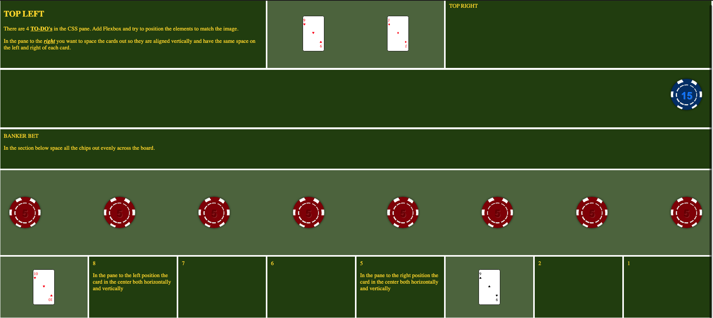
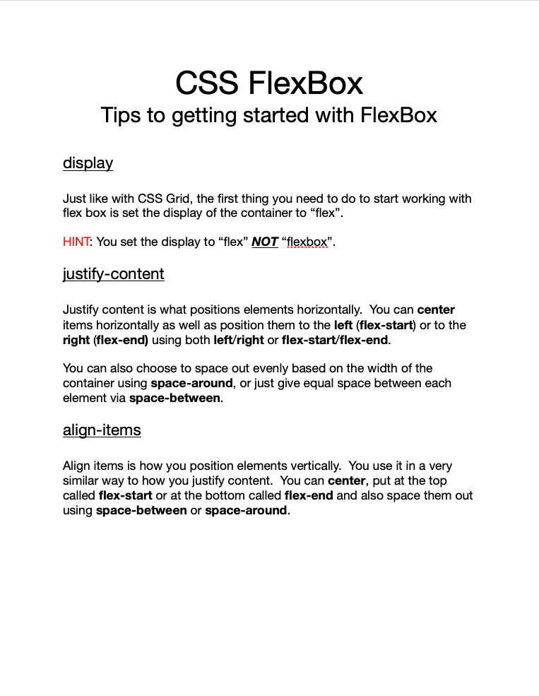

# Connect Session #6

  * Introduction to Flex box

## Lesson Outline

  * Ice-Breaker
    * Go around the room and have everyone introduce themselves
      * Share what got you interested in this course
      * Share one new thing you have learned so far big or small
  * Status Check in
    * Discussion of current student progress
    * Any projects due, how is that going?
  * Topic/Project/ Learning Session
  * Break
    * Activity
  * Recap of lesson
  * Q & A

#### Activity

  * Organize the Table (again)
    * https://codepen.io/rockwellwindsor/pen/MWQrBVE
  * Goal Image  
     

#### Handout

  * Right Click to view image in broswer, left click and select "save image as" to save the image to your computer.
     

#### Resources

  * Flex Box: https://www.w3schools.com/css/css3_flexbox.asp
    * Align items: https://www.w3schools.com/cssref/css3_pr_align-items.asp
    * Justify-content: https://www.w3schools.com/cssref/css3_pr_justify-content.asp
    * Flex Container:  https://www.w3schools.com/css/css3_flexbox_container.asp
    * Flex Items: https://www.w3schools.com/css/css3_flexbox_items.asp
  * Media Queries: https://www.w3schools.com/css/css3_mediaqueries.asp
  * CSS Tricks Flex Box Guide: https://css-tricks.com/snippets/css/a-guide-to-flexbox/
  * Flexbox Froggy: https://flexboxfroggy.com/
