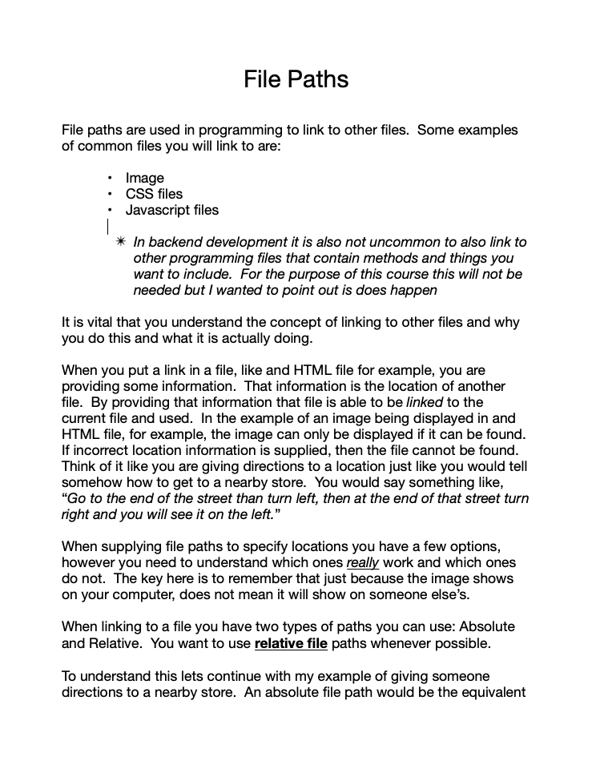
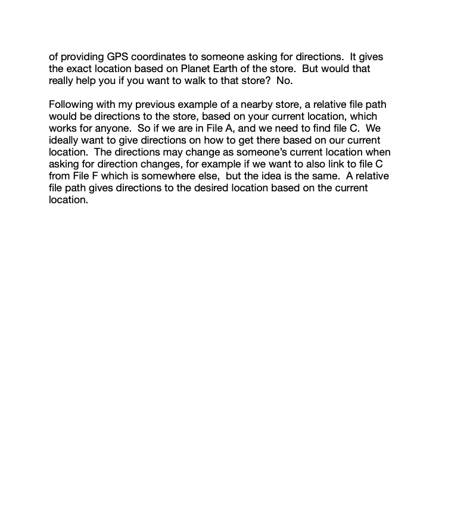
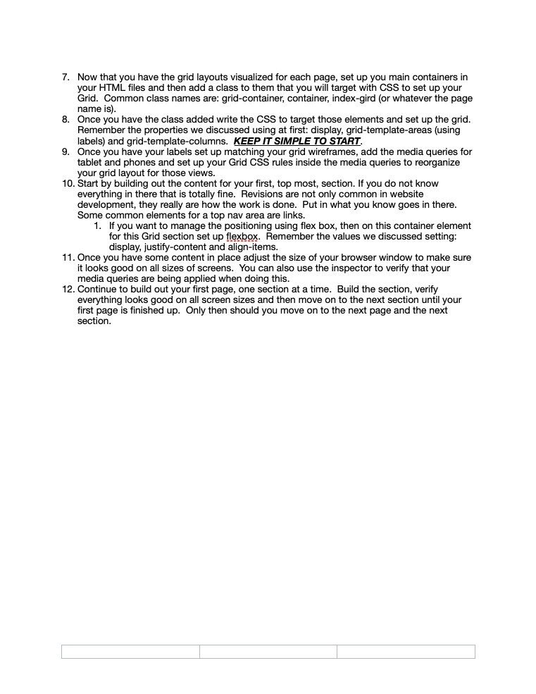
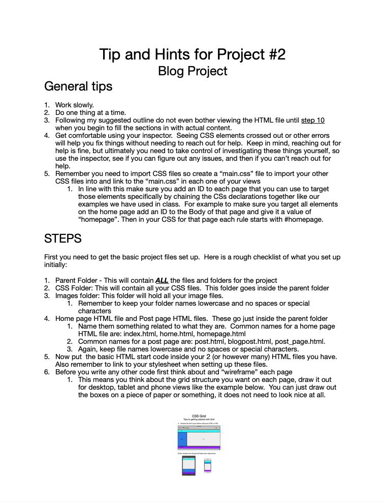
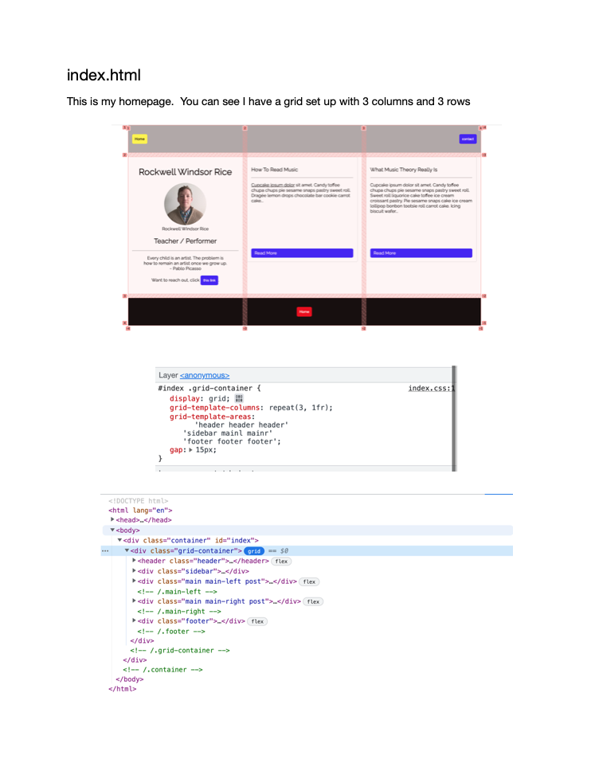
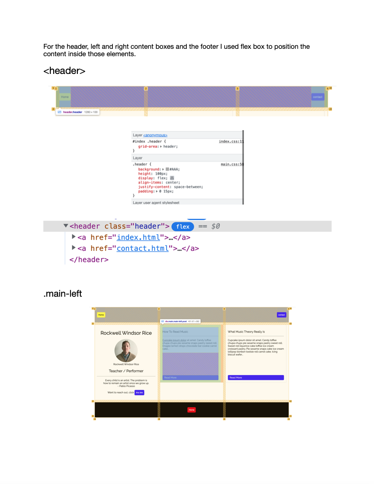
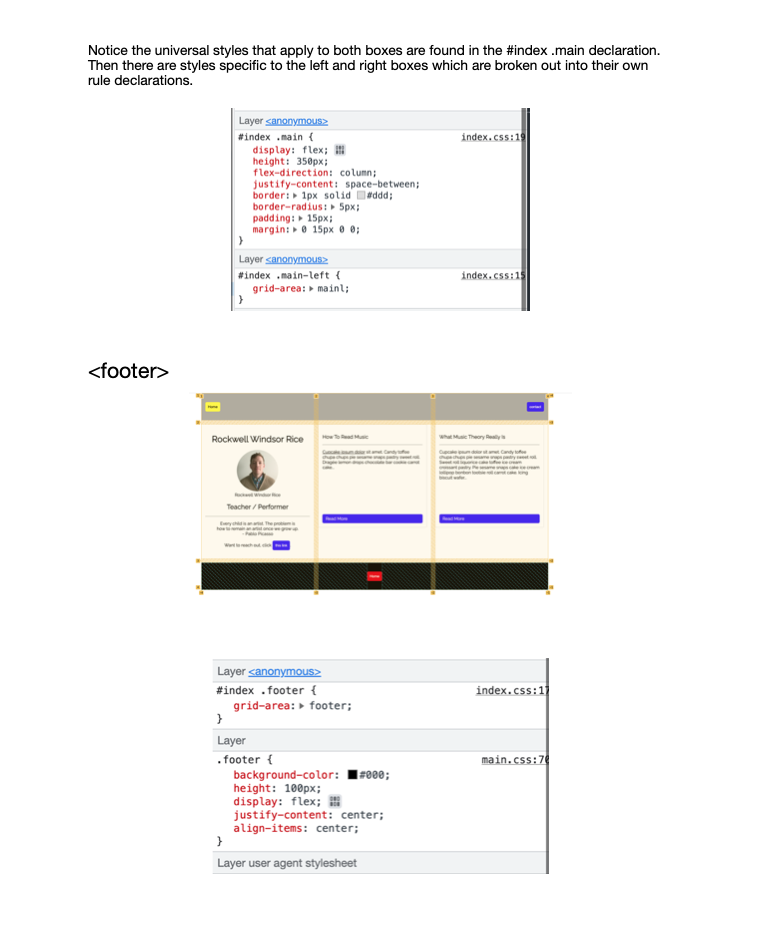

# Connect Session #7

  * Discussing approaches to the Blog Project #2
    * We will also have some discussion on how to manage file paths for linking to files

## Lesson Outline

  * Ice-Breaker
    * How is the week going?
  * Status Check in
    * Discussion of current student progress
    * Any projects due, how is that going?
  * Topic/Project/ Learning Session
  * Break
    * Activity
  * Recap of lesson
  * Q & A

#### Activity

  * Taking a break from the playing cards today to focus on project preparation (don't worry they will be back).

  * For those of you that have not yet tonight our project is to set up the blog project to prepare for building it out

  * Step 1 - Create a folder and name it something related to the project
  * Step 2 inside that folder create 3 more folders.  
    * One for your CSS files.  Title it something related to that, a good example is `css`.Keep it lowercase and no spaces (`site_styles` not `site styles`).  Both work but it will serve you better in the long run to not have spaces.  Ask me why in class if you want an explanation.
    * One folder for your images.
    * One one folder for your pages (the index/landing page can be outside this folder but as per the rubric other pages need to be in this folder)
  * In the parent folder create your home page HTML file.  Name it whatever you like, keep it description and again, lower case no spaces.  Common example would be `index.html`.
  * If you know what other pages you are going to want for the project create them inside the folder you made for the pages.
  * In your CSS folder crate your "main" CS file (see hint #2 below).
  * Use my HTML template if you want to to get a basic template for an HTML file in your HTML files. You can find the HTML by clicking on the "assets" link above and then clicking on the "sample.html" link in that view.
    * Link to your main stylesheet in the HTMl files.

###### TIPS

  * You need to use media queries to ensure your pages are "responsive"  Remember, think about the breakdowns of the structure and build that out and verify it before adding content
  * The rubric also says you need to include 3 import statements in your CSS file.  One way to do that is create one "main" CSS file that is just an import for all the others and you link to that one main file in your views.  Then crate a different CSS file for each page (s you have at least 2 right there) .
    * MAKE SURE YOUR CSS DECLARATIONS ARE NESTED.  So on your home page (and other pages too) wrap the main container with an ID and then nest all CSS under that (different ID for each page).  That way when you import another file they will not override each other
      * `#homepage .someclass {...` Will make sure only elements inside the element with ID `homepage` will have that CSS.
      * `#postpage .someclass {...` will not override or be overridden by other classes related to this from other pages. 

#### Handout

  * Right Click to view image in broswer, left click and select "save image as" to save the image to your computer.
      
     
      
     
    

#### Resources

  * File Paths: https://www.w3schools.com/html/html_filepaths.asp
    * File Paths Blog Post: 
      * https://medium.com/@Linda_Ikechukwu/understanding-file-paths-165c07ec5cf0
      * https://www.kirupa.com/html5/all_about_file_paths.htm
      * https://learn-the-web.algonquindesign.ca/topics/paths-folders/
    * File Paths Videos:
      * https://www.youtube.com/watch?v=WbMVGiKnF3g&ab_channel=PixemWeb
      * https://www.youtube.com/watch?v=EJ0xvY5wT5Q&ab_channel=DaniKrossing

