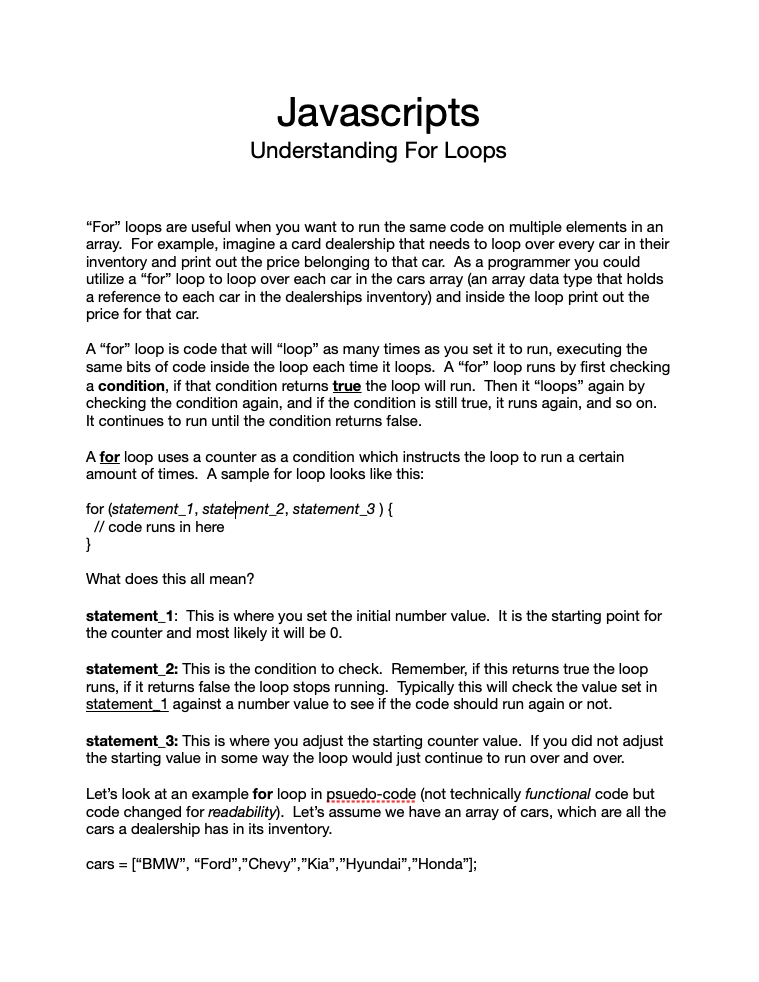
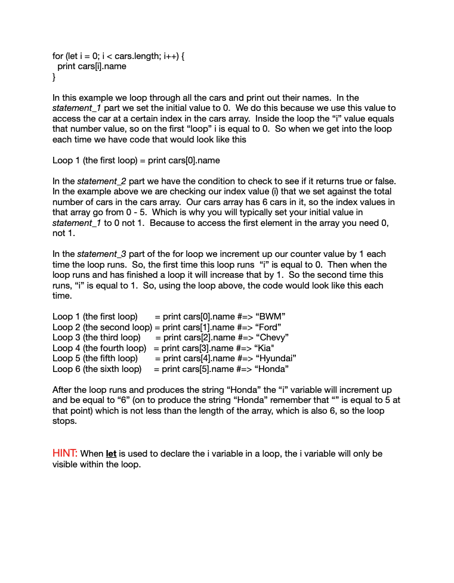
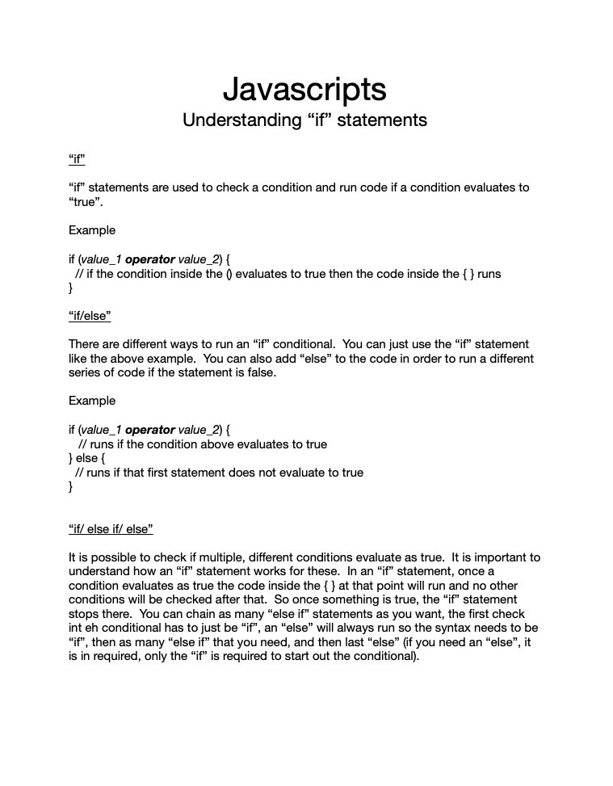

# Connect Session #9

  * Javascript
    * for loops and if statements

## Lesson Outline

  * Ice-Breaker
    * Go around the room and have everyone introduce themselves
      * Share what got you interested in this course
      * Share one new thing you have learned so far big or small
  * Status Check in
    * Discussion of current student progress
    * Any projects due, how is that going?
  * Topic/Project/ Learning Session
  * Break
    * Activity
  * Recap of lesson
  * Q & A

#### Activity

  * Deal to yourself. The best hand wins!1
    * https://codepen.io/rockwellwindsor/pen/XWVjjda

#### Handout

  * Right Click to view image in broswer, left click and select "save image as" to save the image to your computer.
     

#### Resources

  * Javascript: https://www.w3schools.com/js/default.asp
    * conditionals: https://www.w3schools.com/js/js_if_else.asp
    * For Loops: https://www.w3schools.com/js/js_loop_for.asp
    * While Loop: https://www.w3schools.com/js/js_loop_while.asp
  * Javascript Tutorial Channel: https://www.youtube.com/c/JamesQQuick

1 There are no actual prizes to win